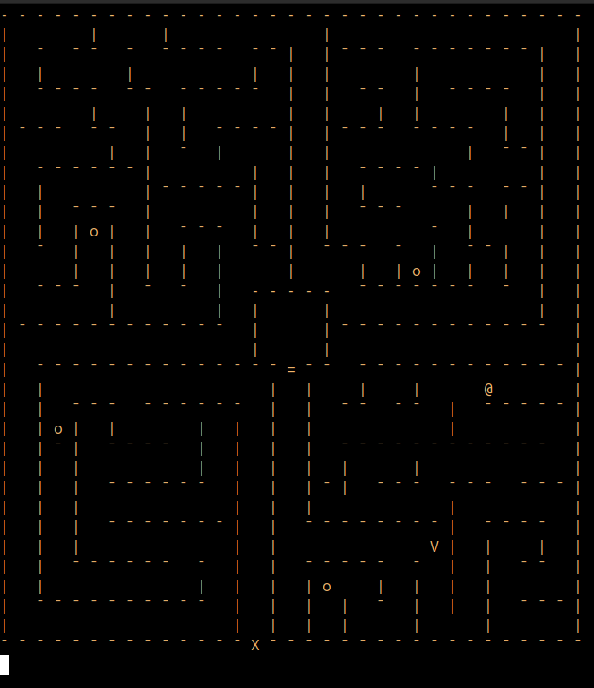

<h1 align="center">
        
</h1>

<h1 align="center">
CRETA    
</h1>

# 📌 Índice
<p align="center">    
  <a href="#-história"> História </a> &nbsp; &nbsp; &nbsp; | &nbsp; &nbsp; &nbsp;        
  <a href="#-como-jogar"> Como jogar </a> &nbsp; &nbsp; &nbsp; | &nbsp; &nbsp; &nbsp;        
  <a href="#ambiente-virtual"> Ambiente Virtual </a> &nbsp; &nbsp; &nbsp; | &nbsp; &nbsp; &nbsp;        
  <a href="#-execução"> Execução </a> &nbsp; &nbsp; &nbsp; | &nbsp; &nbsp; &nbsp;        
  <a href="#-documentação"> Documentação </a> &nbsp; &nbsp; &nbsp; | &nbsp; &nbsp; &nbsp;        
  <a href="#-desenvolvedor"> Desenvolvedor </a>      

# 📜 História
<article>
    <p> 
Na Grécia Antiga, uma construção imponente e grandiosa feita pelo brilhante arquiteto Dédalo se destaca na ilha de Creta: um labirinto que guarda um monstro terrível em seu interior. 
    </p>
    <p>
Metade homem e metade touro, o Minotauro foi aprisionado dentro desse labirinto a mando do Rei Minos para livrar seu reino desse mal que ele mesmo liberou, de forma que a criatura nunca consiga achar a saída. Porém, a força e a raiva dele são incontroláveis até mesmo para a arquitetura de Dédalo, então o Rei envia todo ano jovens para serem devorados e alimentar a fera.
    </p>
    <p>
A época de alimentar o Minotauro chegou e você foi o escolhido para ser enviado ao labrinto de Creta e fazer esse trabalho sujo. Agora, para sobreviver e não virar a comida do monstro, você precisa achar falhas na estrutura que consigam liberar a saída e, o mais importante, não se perder pelos corredores do labirinto. Boa sorte em sua aventura para desvendar a arquitetura complexa de Dédalo e não ser capturado pelo Minotauro.
    </p>
</article>

# 🎮 Como jogar
O objetivo do jogo é fugir do labirinto sem que o minotauro **(V)** alcance o player **(@)**. <br>

Para fugir do labirinto, o player precisa obter quatro itens **(o)** espalhados pelo mapa e, assim, liberar o portão principal **(X)**. Quando o jogo é iniciado, uma pequena cutscene da impressão do tabuleiro e de uma cena de perseguição acontece antes do player estar autorizado a jogar. <br>
**Lembre-se:** cada passo seu também é um movimento feito pelo minotauro, então pense bem em como prosseguir pelo labirinto <br>

Aproveite o jogo!

<h3> Controles </h3>

| Tecla  | Comando |
| ------------- | ------------- |
| w | subir |
| s | descer |
| a | esquerda |
| d | direita |
| q | sair |

<h3> Labirinto </h3>
<p> Conheça o cenário do jogo e seus elementos principais </p>



# 🖥️​ Ambiente virtual
Como criar o ambiente virtual Python desse programa
1. Abra no terminal a pasta do projeto, "Creta"
   
2. Se ainda não tiver instalado, instale a ferramenta `virtualenv`:
   - No Windows:
   ```
   pip install virtualenv
   ```
   - No Linux:
   ```
   sudo apt install virtualenv
   ```
   
4. Crie um ambiente virtual na pasta do projeto:
   ```
   virtualenv nome_do_ambiente
   ```
   ou
   ```
   python3 -m venv nome_do_ambiente
   ```

5. Ative o ambiente virtual:
   - No Windows:
     ```
     .\nome_do_ambiente\Scripts\activate
     ```
   - No Linux/Mac:
     ```
     source nome_do_ambiente/bin/activate
     ```

6. Agora você está no ambiente virtual. Você pode instalar as dependências específicas do programa usando o `pip` e acessando o arquivo 'requirements'. Por exemplo:
   ```
   python3 -m pip install -r ./requirements.txt
   ```

Lembre-se de que, ao terminar o desenvolvimento, você pode desativar o ambiente virtual digitando `deactivate` no terminal.

O ambiente virtual ajuda a isolar as dependências do seu projeto, facilitando o gerenciamento e evitando conflitos entre diferentes projetos Python.

# ⚙ Execução
Como rodar o jogo no seu terminal
1. Abra a pasta "Creta" do projeto no terminal, caso não esteja aberta
2. Execute o ambiente virtual caso ele não esteja ativo, utilizando o nome do ambiente que você criou anteriormente
   - No Windows:
     ```
     .\nome_do_ambiente\Scripts\activate
     ```
   - No Linux/Mac:
     ```
     source nome_do_ambiente/bin/activate
     ```
3. Execute este comando para verificar os argumentos disponíveis:
   ```
   python3 main.py
   ```
4. Execute esse comando para conhcer cada argumento:
   ```
   python3 main.py -h
   ```
5. Para abrir o jogo, digite um comando como o do exemplo abaixo:
   ```
   python3 main.py Di3go -s
   ```
Lembre-se de que sempre é necessário fornecer um nome de usuário e o argumento -s deve ser informado quando desejar remover o áudio do jogo <br>
Detalhe: quando iniciada, mesmo se o programa finalizar, a música só vai parar de tocar quando acabar sua duração  

# 🗂️ Documentação
Este repositório do projeto conta com alguns documentos que são importantes para a excecução do jogo ou para conhecer suas caracteristícas <br>

**Essenciais ao jogo:** <br>
- labirintoInfos.csv -> tabela com a posição x e y e com o caracter a ser inserido na matriz do labirinto. O programa le as informações presentes em cada linha e adiciona o elemento ao labirinto para prenche-lo com os obstáculos <br>
- requirements.txt -> arquivo de texto com as bibliotecas utilizadas no projeto

**Extra:** <br>
- pasta docs -> a pasta conta com arquivos '.html' que explicam o funcionamento das funções criadas para o jogo, as chamadas docstrings do projeto

# 👨‍💻 Desenvolvedor

Diego Penna Andrade Barros <br>
PDITA 274
